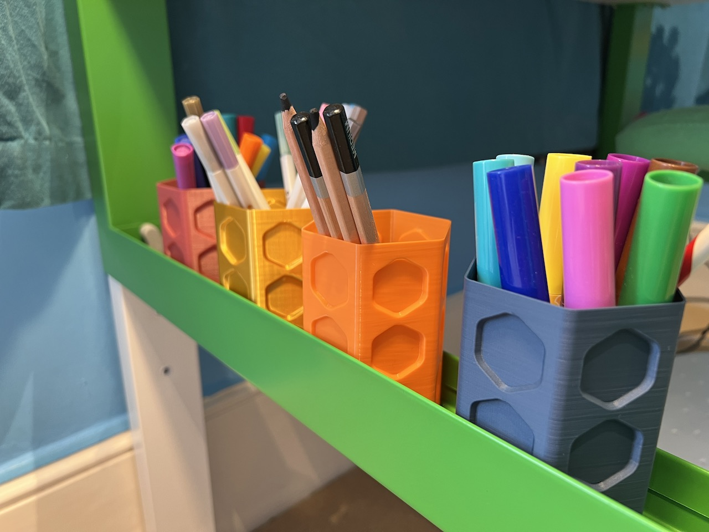

# Hexvåhl hexagon vase

Hexvåhl is a rounded hexagon vase for IKEA Påhl.

Why?

- Hexagons are neat

- Rounded hexagons are less pointy

- Rounded hexagons with hexagon shapes inside them are neat

It's the perfect shape for organising pens.

It is sized to fit in the trays between the IKEA Påhl kids' desk legs.

I printed it in vase mode with a 0.4 mm nozzle, with 6 bottom layers and external perimeters extrusion width of 0.8 mm. Show me your makes!

<https://www.printables.com/model/376762-a-scan-of-an-apple>

## License

CC0

## Author

Leon Brocard <acme@astray.com>
